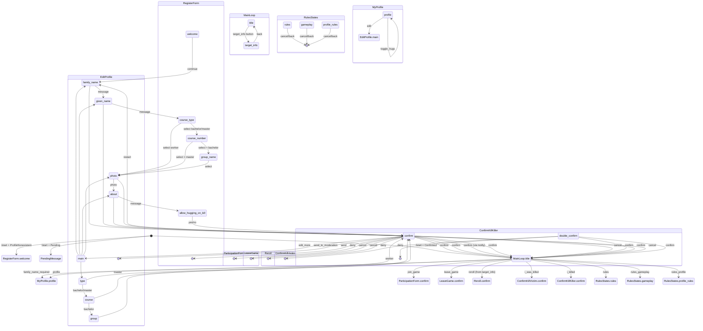

# Dialog Tree (user-facing flows)

This document maps the Telegram bot dialog flow as implemented in `bot/handlers/*` and `services/states/*`.
Text labels are referenced by key (e.g. `texts.get("registration.welcome")`) to avoid duplicating strings.

## Entry points

- `/start` + `ProfileNonexistentFilter` -> start `RegisterForm.welcome`.
- `/start` + `PendingFilter` -> send `texts.get("registration.pending")` (no dialog).
- `/start` + `ConfirmedFilter` + `UserFilter` ->
  - if `user.family_name_required` -> send `texts.get("profile.family_name_required")`, start `MyProfile.profile`.
  - else -> start `MainLoop.title` with `game_id` (active game or `None`).

## Mermaid overview

## Dialogs and transitions (details)

### Registration (`RegisterForm`)

- `RegisterForm.welcome`
  - Buttons: `buttons.rules_profile` -> `RulesStates.profile_rules` (starts new dialog)
  - Buttons: `buttons.continue` -> `RegisterForm.family_name`
- `RegisterForm.family_name`
  - MessageInput -> `RegisterForm.given_name`
  - Buttons: `buttons.rules_profile` -> `RulesStates.profile_rules`
- `RegisterForm.given_name`
  - MessageInput -> `RegisterForm.course_type`
  - Buttons: `buttons.back` -> `RegisterForm.family_name`
- `RegisterForm.course_type`
  - Buttons (type) -> `RegisterForm.course_number` (bachelor/master) OR `RegisterForm.photo` (worker)
  - Buttons: `buttons.back` -> `RegisterForm.given_name`
- `RegisterForm.course_number`
  - Buttons (course) -> `RegisterForm.group_name` (bachelor) OR `RegisterForm.photo` (master)
  - Buttons: `buttons.back` -> `RegisterForm.course_type`
- `RegisterForm.group_name`
  - Buttons (group) -> `RegisterForm.photo`
  - Buttons: `buttons.back` -> `RegisterForm.course_type`
- `RegisterForm.photo`
  - MessageInput (photo) -> `RegisterForm.about`
  - Buttons: `buttons.back` -> `RegisterForm.group_name`
- `RegisterForm.about`
  - MessageInput -> `RegisterForm.allow_hugging_on_kill`
  - Buttons: `buttons.back` -> `RegisterForm.course_type`
- `RegisterForm.allow_hugging_on_kill`
  - Buttons: `buttons.hug_yes` / `buttons.hug_no` -> `RegisterForm.confirm`
  - Buttons: `buttons.back` -> `RegisterForm.about`
- `RegisterForm.confirm`
  - Buttons: `buttons.send` -> create `PendingProfile`, notify admins, `manager.done()`
  - Buttons: `buttons.restart` -> `RegisterForm.family_name`

### Main menu (`MainLoop`)

- `MainLoop.title`
  - Buttons (always):
    - `buttons.profile` -> `MyProfile.profile`
    - `buttons.rules` -> `RulesStates.rules`
    - `buttons.rules_gameplay` -> `RulesStates.gameplay`
    - `buttons.rules_profile` -> `RulesStates.profile_rules`
  - Buttons (conditional):
    - `buttons.join_game` -> `ParticipationForm.confirm` (bg dialog)
    - `buttons.leave_game` -> `LeaveGame.confirm`
    - `buttons.get_target` -> enqueue in matchmaking (no state change)
    - `buttons.was_killed` -> `ConfirmKillVictim.confirm` if pending victim event
    - `main_menu.target_label` -> `MainLoop.target_info` if `has_target`
  - Links (conditional): `buttons.discussion`, `buttons.next_game`

- `MainLoop.target_info`
  - Buttons: `buttons.surrender` -> `Reroll.confirm`
  - Buttons: `buttons.i_killed` -> `ConfirmKillKiller.confirm`
  - Links (conditional): `buttons.write_report`, `buttons.open_profile`
  - Back -> `MainLoop.title`

### Rules (`RulesStates`)

Each state shows a text blob and `buttons.back` (Cancel):

- `RulesStates.rules`
- `RulesStates.gameplay`
- `RulesStates.profile_rules`

### Profile (`MyProfile`, `EditProfile`)

- `MyProfile.profile`
  - Buttons: `profile.hugs_label` -> toggle hugging, stay in `MyProfile.profile`
  - Buttons: `buttons.edit` -> `EditProfile.main`
  - Buttons: `buttons.back` -> Cancel (return to previous dialog)

- `EditProfile.main`
  - Buttons: `buttons.profile_family_name` -> `EditProfile.family_name`
  - Buttons: `buttons.profile_given_name` -> `EditProfile.given_name`
  - Buttons: `buttons.profile_academic` -> `EditProfile.type`
  - Buttons: `buttons.profile_description` -> `EditProfile.about`
  - Buttons: `buttons.profile_photo` -> `EditProfile.photo`
  - Buttons: `buttons.back` -> Cancel

- `EditProfile.type`
  - Buttons (type) -> `EditProfile.course` (bachelor/master) OR `EditProfile.confirm` (worker)
  - Cancel -> back
- `EditProfile.course`
  - Buttons (course) -> `EditProfile.group` (bachelor) OR `EditProfile.confirm` (master)
  - Cancel -> back
- `EditProfile.group`
  - Buttons (group) -> `EditProfile.confirm`
  - Cancel -> back
- `EditProfile.family_name` / `EditProfile.given_name` / `EditProfile.about` / `EditProfile.photo`
  - MessageInput -> `EditProfile.confirm`
  - Cancel -> back
- `EditProfile.confirm`
  - Buttons: `profile.add_more_fields` -> `EditProfile.main`
  - Buttons: `profile.send_to_moderation` -> create `PendingProfile`, notify admins, `manager.done()`
  - Buttons: `buttons.cancel` -> Cancel

### Participation (`ParticipationForm`)

- `ParticipationForm.confirm`
  - Buttons: `participation.confirm_yes` -> join game, enqueue, start `MainLoop.title`
  - Buttons: `participation.confirm_no` -> `manager.done()`

### Leave game (`LeaveGame`)

- `LeaveGame.confirm`
  - Buttons: `leave.confirm` -> apply penalty, set cooldown, reset queues, start `MainLoop.title`
  - Buttons: `leave.cancel` -> Cancel

### Reroll (`Reroll`)

- `Reroll.confirm`
  - Buttons: `reroll.confirm` -> reject kill, adjust ratings, re-queue, notify players + chat, start `MainLoop.title`
  - Buttons: `reroll.cancel` -> Cancel

### Kill confirmation (`ConfirmKillVictim`, `ConfirmKillKiller`)

- `ConfirmKillVictim.confirm`
  - Buttons: `kills.victim_confirm_button` -> confirm, possibly send `ConfirmKillKiller.double_confirm` to killer, start `MainLoop.title`
  - Cancel -> back
- `ConfirmKillVictim.double_confirm`
  - Buttons: `kills.victim_confirm_button` -> confirm, finalize if both confirmed
  - Buttons: `kills.victim_deny_button` -> deny

- `ConfirmKillKiller.confirm`
  - Buttons: `kills.killer_confirm_button` -> confirm, possibly send `ConfirmKillVictim.double_confirm` to victim, start `MainLoop.title`
  - Cancel -> back
- `ConfirmKillKiller.double_confirm`
  - Buttons: `kills.killer_confirm_button` -> confirm, finalize if both confirmed
  - Buttons: `kills.killer_deny_button` -> deny

## Admin flows

### Admin commands

- `/stats` -> send stats message (no dialog)
- `/creategame` -> `StartGame.name`
- `/editgame` -> `EditGame.game_id`
- `/endgame` -> immediate end + credits (no dialog stack)
- `/rollbackkill <uuid>` -> rollback kill (no dialog)
- `/ban <tg_id> [reason]` -> ban user (no dialog)

### Start game (`StartGame`)

- `StartGame.name` -> MessageInput -> `StartGame.confirm`
- `StartGame.confirm`
  - Buttons: `admin.creategame.confirm_yes` -> create game, notify users, start `ParticipationForm.confirm` for each
  - Buttons: `admin.creategame.confirm_no` -> back to `StartGame.name`

### Edit game (`EditGame`)

- `EditGame.game_id` -> select game -> `EditGame.edit`
- `EditGame.edit`
  - Buttons: `admin.editgame.end_game` -> end game (handler), stay `EditGame.edit`
  - Buttons: `admin.editgame.show_info` -> `EditGame.info`
  - Buttons: `admin.editgame.back` -> `EditGame.game_id`
- `EditGame.info` -> `admin.editgame.back` -> `EditGame.edit`

### Profile moderation (`ProfileModeration`)

- Admin receives pending profile message with inline buttons (not dialog-based).
  - Confirm button -> apply changes, notify user, start `MainLoop.title` for approved user.
  - Deny button -> set moderator FSM state `ProfileModeration.waiting_reason`.
- `ProfileModeration.waiting_reason`
  - Next moderator message with reason -> store denial reason, notify user, clear state.
  - Messages with pending-id payload also accepted without FSM state.

